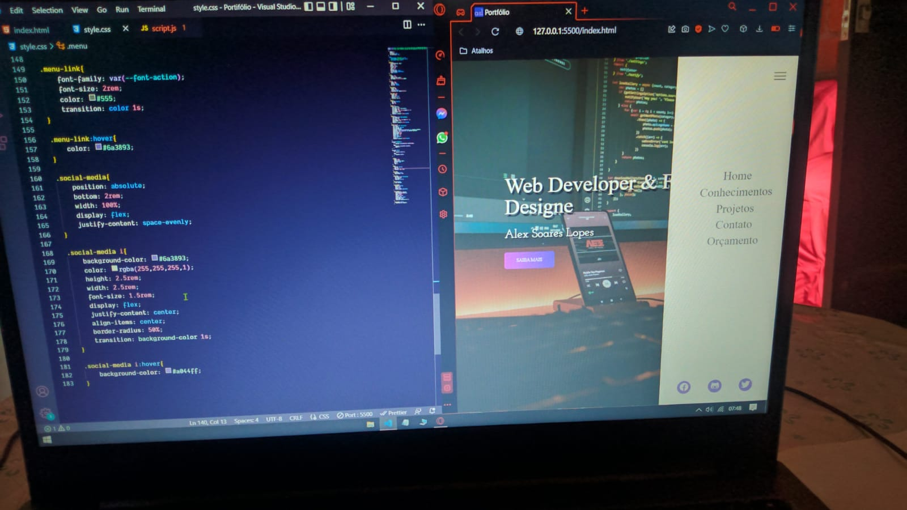

# CurriculoFork
ProjetoWeb Curricular

<h1>Erro:</h1>

O evento não está sendo inicializado

<strong>Qual evento: </strong>

A barra de menu não é inicializada

<h3>Segue a imagem das expectativas: </h3>

<h1>Processamento da Aplicação: </h1>

1- Refatoramento do HTML

2- Criar "Evento" via css por via de classes.

3- Animação básica sobre a barra lateral

